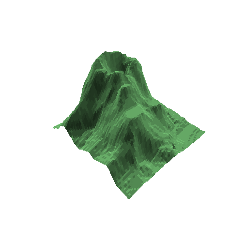
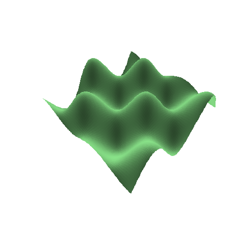
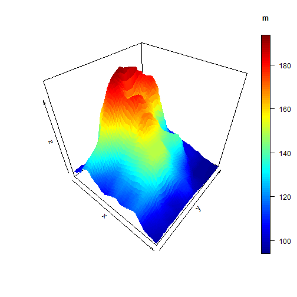

SpectaculaR 
========================================================
R 3D demonstration  
author: gjamnitz  
date: 20/2/2015

Application 
========================================================

- Welcome to SpectaculaR, the application demonstrating 3d capabilities of R!
- Simple to use
- Displays 5 different 3d objects
- Objects can be rotated and
- Viewpoint height can be set with sliders

Examples
========================================================

 
***
 

How it works
========================================================

 **persp** function is used to display 3D objects  
 function parameters: 
 * x, y - vectors 
    - from -5 to 5 by 0.1
 * z - matrix
    + contains height values calculated from x and y
    + mostly trigonometric functions used for creating objects
 * shade, scale, view angle, color etc. parameters 

Volcano displays a 3d "map" of [Volcano Maunga Whau in Auckland](http://geomorphometry.org/content/volcano-maungawhau)   
 * data in *datasets* package in R

Further development opportunities
========================================================

- writing functions from scratch on UI and displaying them
- using plot3d package (many more possibilities)
 
